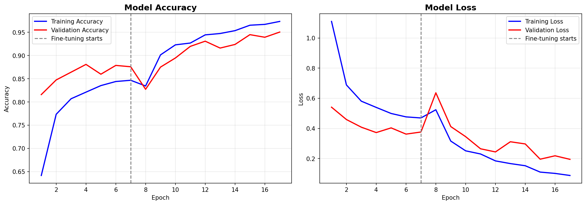

# 🌿 Crop Disease Detection Using AI
### Microsoft Elevate AICTE Internship Project — AIML Domain


---

## 🔗 Live Demo
👉 **[Click here to open the app](https://your-app-link.streamlit.app)**
> *(Replace this link with your actual Streamlit URL after deployment)*

---

## 📌 Problem Statement
India loses approximately **20–40% of agricultural yield** every year due to crop diseases that go undetected until it is too late. Smallholder farmers lack access to agricultural experts who can diagnose plant diseases quickly. This project provides an affordable, fast, and accessible AI-powered solution that farmers can use directly from their smartphones.

---

## ✅ Proposed Solution
An AI-powered **Crop Disease Detection web application** where farmers can:
1. Upload a photo of a crop leaf
2. Instantly get the disease name identified
3. Receive actionable treatment and remedy advice

---

## 🧠 Model Details
| Detail | Value |
|--------|-------|
| Architecture | MobileNetV2 (Transfer Learning) |
| Dataset | PlantVillage (Kaggle) |
| Training Images | ~16,000+ images |
| Number of Classes | 15 |
| Training Accuracy | 97.47% |
| Validation Accuracy | **95.05%** |
| Framework | TensorFlow / Keras |

---
## 📈 Training Graph

```

📊 Training Results
- Phase 1 (Feature Extraction): Val Accuracy → 88.09%
- Phase 2 (Fine-Tuning): Val Accuracy → 95.05%

📈 Training Graph
[your beautiful accuracy/loss graph shown here]

## 🌱 Supported Crops & Diseases (15 Classes)

| Crop | Disease / Condition |
|------|-------------------|
| 🌶️ Bell Pepper | Bacterial Spot, Healthy |
| 🥔 Potato | Early Blight, Late Blight, Healthy |
| 🍅 Tomato | Bacterial Spot, Early Blight, Late Blight, Leaf Mold, Septoria Leaf Spot, Spider Mites, Target Spot, Yellow Leaf Curl Virus, Mosaic Virus, Healthy |

---

## 🛠️ Tech Stack
- **Model:** TensorFlow, Keras, MobileNetV2
- **Web App:** Streamlit
- **Image Processing:** Pillow, NumPy
- **Training Environment:** Google Colab (GPU)
- **Dataset:** PlantVillage (Kaggle)
- **Deployment:** Streamlit Cloud

---

## 📁 Project Structure
```
crop-disease-detection/
├── app.py                  # Streamlit web application
├── crop_disease_model.h5   # Trained MobileNetV2 model
├── class_names.json        # Disease class labels
├── requirements.txt        # Python dependencies
└── README.md               # Project documentation
```

---

## 🚀 How to Run Locally
```bash
git clone https://github.com/your-username/crop-disease-detection.git
cd crop-disease-detection
pip install -r requirements.txt
streamlit run app.py
```

---

## 📊 Training Results
- **Phase 1** (Feature Extraction): Val Accuracy → **88.09%**
- **Phase 2** (Fine-Tuning): Val Accuracy → **95.05%**
- Model correctly identifies all 15 disease classes with high confidence

---

## 🌍 Social Impact
- Helps farmers detect crop diseases **instantly** without needing an expert
- Prevents **20–40% yield loss** through early detection
- Free and accessible via any smartphone browser
- Bridges the gap between modern AI and grassroots farming communities

---

## 📚 References
1. Hughes, D.P. & Salathé, M. (2015). PlantVillage Dataset. arXiv:1511.08060
2. Sandler, M. et al. (2018). MobileNetV2. IEEE CVPR 2018
3. Mohanty et al. (2016). Using Deep Learning for Plant Disease Detection. Frontiers in Plant Science
4. [TensorFlow Transfer Learning Guide](https://www.tensorflow.org/tutorials/images/transfer_learning)
5. [PlantVillage Dataset on Kaggle](https://www.kaggle.com/datasets/emmarex/plantdisease)

---
